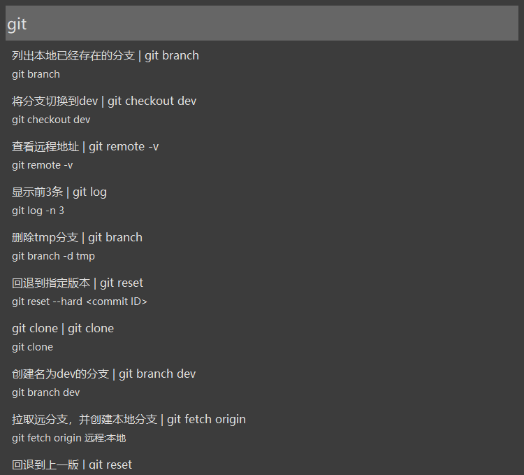
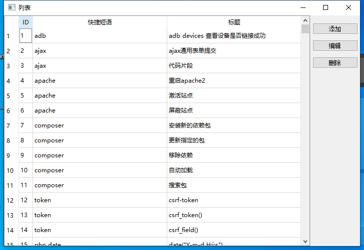
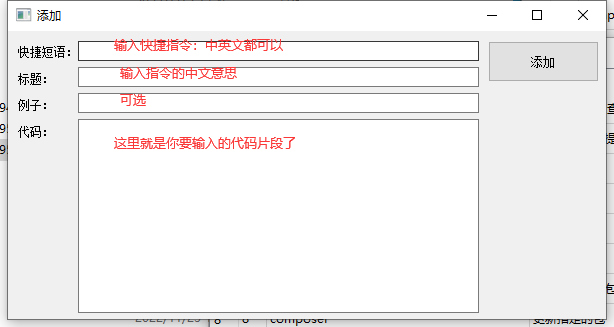

# KK-CODE
---
<p align="left">
    
    
	
	
	
    
</p>
[](https://gitee.com/mirrors/srsLTE/members)
[](https://gitee.com/mirrors/srsLTE/members)

程序员命令太多记不住怎么办，快来试试`kk-code`命令快捷输入工具吧。命令、代码片段都能帮你记住。

用python开发的代码片段快捷输入工具。
开发环境:python3.7


#### 运行：

```
pythonw kk.py
```

备注：如果用`python kk.py`会弹出`cmd`窗口。建议用`pythonw kk.py`运行


#### 使用：

按两次`Ctrl+Alt`键，会弹出快捷输入框，输入自定义的`快捷短语`。`回车`或者选择需要复制的快捷短语就会自动复制到剪贴板上面。




#### 添加编辑：
输入`:edit`会弹出编辑窗口：


编辑窗口：



添加：




#### 创建新的空数据库：

`data.db`为数据库文件。如果需要重新生成数据库文件可以用`python kk.py --create_ok`命令创建新的空数据库`data_new.db`然后重命名为`data.db`就可以用了。


#### 用到的`python`库，用`pip`或者`pip3`命令安装

```
pip install pypiwin32
pip install argparse
pip install PyQt5
pip install keyboard
```