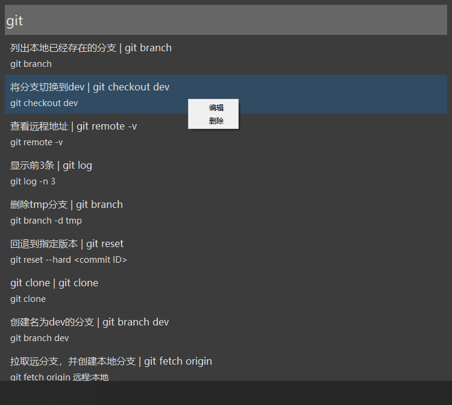

# Code Assistant(代码输入助手)

用python写的代码输入助手小程序。

命令太多，很容易忘记，还有很多代码片段想保存下来用到的时候能够快速输入，提高开发效率。在网上找了很多，发现都不是自己想要的。于是就用python写了一个自己用的代码输入助手小程序，我自己已经用了很长时间了，感觉慢好用的，可以很方便的输入一些复杂且经常忘记的命令和常用到的代码片段。

开发环境:python3.7

#### 运行：
下载发行版，解压后运行`kk.exe`

#### 使用：

按两次`Ctrl+Alt`键，会弹出快捷输入框，输入自定义的`快捷短语`。`回车`或者选择需要复制的快捷短语就会自动复制到剪贴板上面。

`ESC`退出，`回车`隐藏。

**使用前别忘记先添加命令**

#### 添加：
输入` :add`会弹出添加窗口：

添加窗口：

#### 编辑：

右键点击列表选项会弹出菜单可以进行编辑和删除操作

#### 创建新的空数据库：

`data.db`为数据库文件。如果需要重新生成数据库文件可以用`kk.exe --create_ok`命令创建新的空数据库`data_new.db`然后重命名为`data.db`就可以用了。