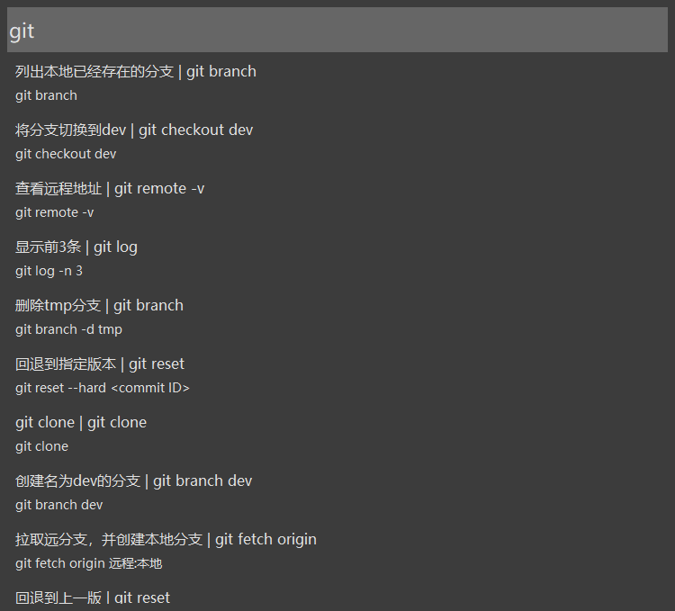
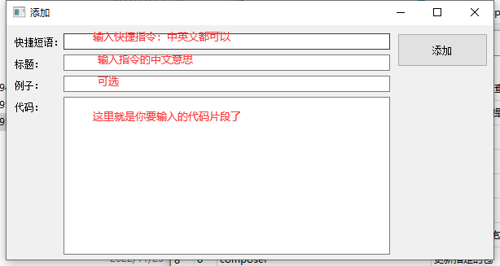
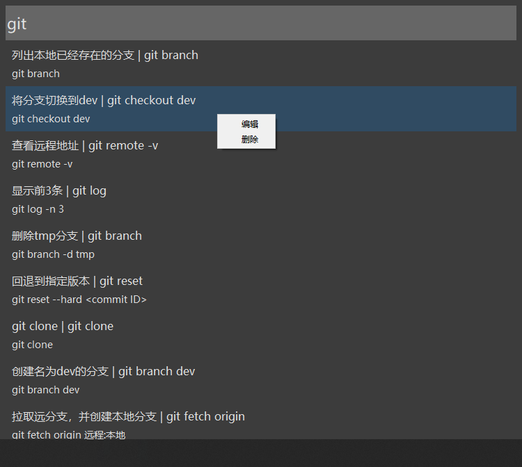

# Code Assistant(代码输入助手)

[]()
[]()
[]()
[]()
[]()


基于 PyQt5 的 Windows 代码片段快捷输入工具。通过全局热键 `Ctrl+Alt+K` 呼出搜索框，输入关键字即可快速匹配已保存的命令或代码片段，一键复制到剪贴板并自动粘贴到当前光标位置，大幅提升开发效率。

开发环境:python3.8


#### 运行：
```bash
pip install -r requirements.txt
pythonw kk.py # 运行
pythonw kk.py;exit # 运行并关闭终端窗口
```
程序启动后会在**后台驻留**，随时可通过全局热键呼出。


#### 使用：

按下 **`Ctrl+Alt+K`** 全局热键，呼出快捷输入框，输入自定义快捷短语即可实时搜索匹配。

| 快捷键 | 功能 |
|---|---|
| `Ctrl+Alt+K` | 全局热键，任意位置呼出/激活窗口 |
| `Ctrl+K` | 聚焦搜索栏并全选内容 |
| `↓` | 从搜索栏切换到结果列表 |
| `↑` | 在列表第一项时回到搜索栏 |
| `回车` | 选中项复制到剪贴板并隐藏窗口 |
| `Ctrl+回车` | 复制到剪贴板**并自动粘贴**到当前光标位置 |
| `ESC` | 退出/关闭窗口 |

搜索时，匹配的关键字会在结果列表中**高亮显示**。输入内容有150ms防抖，避免频繁查询。

> **使用前别忘记先添加命令**




#### 数据字段说明：

每条记录包含以下字段：

| 字段 | 说明 |
|---|---|
| 关键字(keyword) | 用于搜索匹配的短语 |
| 标题(title) | 显示在列表首行 |
| 代码/示例(example) | 显示在列表第二行 |
| 内容(note) | 复制到剪贴板的实际文本 |
| 保密(is_secret) | 勾选后，列表中内容显示为 `******` |

鼠标悬停在列表项上可通过 tooltip 查看完整的备注内容。

#### 添加：
输入 `:add` 会弹出添加窗口：


添加窗口：



#### 编辑：

右键点击列表选项会弹出菜单可以进行编辑和删除操作



#### 高级功能：

- **单实例运行**：重复启动程序不会打开多个窗口，而是激活已有的运行实例
- **深色主题**：暗灰色配色（#3c3c3c），护眼舒适
